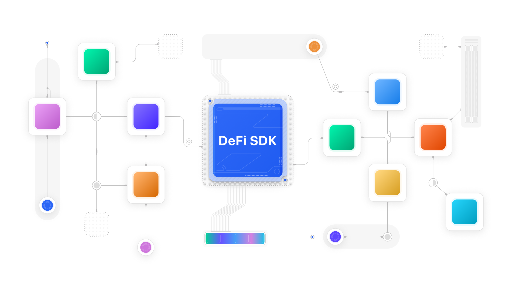

# DeFi SDK

**DeFi SDK** is an open-source system of smart contracts designed for precise DeFi portfolio accounting. To put it simply, DeFi SDK is the on-chain *balanceOf* for DeFi protocols.

If you have any questions about DeFi SDK, feel free to reach out to us on our [Discord server](https://go.zerion.io/discord){target=_blank}.

## Features

**💥Query user assets and debt deposited in DeFi protocols like *Maker, Aave, dYdX*, etc.**

How much debt does `0xdead..beef` have on Compound?

**📊Get the underlying components of complex derivative ERC20 tokens**

How much `cUSDC` vs `ETH` does `ETHMACOAPY` have?

> Both cases are described in [How to get read-only data from DeFi SDK contracts](reading.md)

**✨Interact with multiple DeFi protocols in a unified way**

Use one interface to deposit tokens for lending, LP pools, etc.

> See [How to interact with DeFi SDK contracts](interacting.md)

**💸Trade on L2 chains using one contract**
> Read [Router](router.md) documentation
